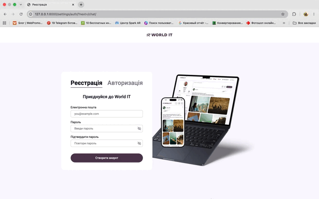

<h1>Social Network</h1>

<a name="articles"><h3>Table of contents / Зміст</h3></a>

# 🇺🇦 Українська версія / Ukrainian Version

## Зміст
* [Основний функціонал та перелік модулів](#основний-функціонал-та-перелік-модулів)
* [Стек технологій](#стек-технології)

---

## Основний функціонал та перелік модулів

Проєкт побудований за модульною архітектурою Django, де кожний додаток створено окремо для виконання різноманітних функцій та логіки проєкта:

* **`Social_network` (Головний модуль нашого проєкту):** Містить кореневі налаштування проєкту `settings.py`, маршрутизацію URL-адрес `urls.py` та конфігурацію асинхронного ASGI-сервера `asgi.py` для обробки WebSocket-з'єднань.
* **`chat_app` (Модуль месенджера):** Реалізує логіку обміну повідомленнями в реальному часі через WebSockets. Включає асинхронні консюмери `consumers.py`, маршрутизацію сокетів `routing.py` та відокремлений сервісний шар `services/` для кастомної пагінації чатів, груп і повідомлень.
* **`user_app` (Модуль користувачів та автентифікації):** Відповідає за кастомну модель користувача, реєстрацію, AJAX-авторизацію, керування сесіями та верифікацію через email-коди. Містить власний шар сервісів (`services/`) для обробки соціальних зв'язків та генерації наших токенів.
* **`profile_app` (Модуль профілів користувачів):** Керує персональними сторінками користувачів, відображенням інформації про користувачів і тд, налаштуваннями профілю `settings.html` та списками друзів.
* **`post_app` (Модуль публікацій нашого додатку):** Відповідає за створення постів, обробку тегів та в принципі взаємодію з контентом, що знаходиться у додатку.
* **`home_app` (Модуль головної сторінки):** Реалізує фід-ленту з динамічним завантаженням публікацій без перезавантаження сторінки за допомогою AJAX `post_load.js`.

---

## Стек технології

### Ключові технології нашого проєкту, які ми використовували
* **Django:** Головний високорівневий веб-фреймворк на Python для швидкої та безпечної розробки.
* **Django Channels & Daphne:** Асинхронне розширення для Django, що дозволяє обробляти не лише HTTP, а й довготривалі з'єднання, такі як WebSockets. Daphne виступає як ASGI-сервер.
* **WebSockets:** Протокол двостороннього обміну даними в реальному часі між браузером та сервером (використовується для чатів та онлайн-статусів).

### Детальний розбір `requirements.txt`

| Бібліотека / Пакет | Для чого їх використовують у проєкті? |
| :--- | :--- |
| **`Django`** | Основа проєкту. Забезпечує роботу ORM бази даних, маршрутизацію URL, обробку запитів Views та рендеринг HTML-шаблонів. |
| **`channels`** | Інтегрує підтримку асинхронних протоколів у Django, дозволяючи створювати `Consumers` для WebSocket-з'єднань. |
| **`daphne`** | Асинхронний ASGI-сервер, який запускає проєкт замість стандартного WSGI, щоб підтримувати HTTP та WebSockets водночас. |
| **`Pillow`** | Бібліотека для обробки зображень. Необхідна Django для валідації та збереження файлів у полях `ImageField` (аватари користувачів та вся медіа, яка знаходиться в постах). |
| **`asgiref`** | Набір інструментів для взаємодії між асинхронним (async) та синхронним (sync) кодом в Python. Використовується для виклику ORM-запитів у сокетах. |

---
---

# 🇬🇧 Англійська версія / English Version

## Table of Contents
* [Main Functionality & Modules List](#main-functionality--modules-list)
* [Technology Stack](#technology-stack)

---

## Main Functionality & Modules List

The project follows a modular Django architecture, where each application is created separately to perform various functions and project logic:

* **`Social_network` (Core module of our project):** Contains root project settings `settings.py`, URL routing `urls.py`, and the asynchronous ASGI server configuration `asgi.py` to handle WebSocket connections.
* **`chat_app` (Messenger module):** Implements real-time messaging logic via WebSockets. Includes async consumers `consumers.py`, socket routing `routing.py`, and a dedicated service layer `services/` for custom pagination of chats, groups, and messages.
* **`user_app` (User & Authentication module):** Handles the custom user model, registration, AJAX authentication, session management, and email verification codes. Contains its own service layer (`services/`) for handling social graph queries and generating our tokens.
* **`profile_app` (User Profiles module):** Manages user personal pages, user data display, etc., settings (`settings.html`), and friend lists.
* **`post_app` (Our application's Publications module):** Responsible for post creation, tag processing, and overall interaction with the content located within the application.
* **`home_app` (Home Page module):** Implements the news feed with dynamic post loading using AJAX (`post_load.js`) without full page reloads.

---

## Technology Stack

### Core technologies of our project that we used
* **Django:** The main high-level Python Web framework used for rapid and secure development.
* **Django Channels & Daphne:** An async extension for Django that enables handling long-lived connections like WebSockets, in addition to HTTP. Daphne acts as the primary ASGI server.
* **WebSockets:** A protocol providing full-duplex communication channels over a single TCP connection between the browser and the server (used for chat rooms and online status tracking).

### Detailed `requirements.txt` Breakdown

| Library / Package | What are they used for in the project? |
| :--- | :--- |
| **`Django`** | The core framework. Provides the ORM database access, URL routing, Request/Response handling (Views), and HTML template rendering. |
| **`channels`** | Integrates asynchronous protocol support into Django, enabling WebSocket `Consumers`. |
| **`daphne`** | An ASGI-compatible web server that runs the project instead of standard WSGI to support both HTTP and WebSockets simultaneously. |
| **`Pillow`** | Image processing library. Required by Django to validate and save files in `ImageField` models (user avatars and all media within posts). |
| **`asgiref`** | A set of tools for dual async/sync Python development. Used to safely run synchronous Django ORM queries inside async consumers. |