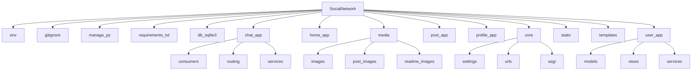

<h1>Social Network</h1>


<a name="articles"><h3>Table of contents</h3></a>

# Project Description
<h5>Опис проєкту</h5>

[Project description](#headers)

# Information about our team
<h5>Інформація про команду</h5>

[Information about our team](#team)

# Our project structure
<h5>Структура проєкту</h5>

[structure of project](#structure)

# Getting Started
<h5>Як запустити проєкт</h5>

[Getting started](#getting_started)

# Environment Variables (.env)
<h5>Змінні середовища</h5>

[Environment variables](#env)

# Modules Description
<h5>Опис модулей</h5>

[Modules description](#modules)

# Package Description
-   [Package description](#package_description)
    - [describe Social_network package](#core)
    - [describe user_app package](#user_app)
    - [describe profile_app package](#profile_app)
    - [describe post_app package](#post_app)
    - [describe home_app package](#home_app)
    - [describe chat_app package](#chat_app)

# Problems when creating a project
[Problems during development](#prbl_project)

# Conclusion
[Conclusion](#conclusions)

---

<a name="headers"><h1>Project description</h1></a>

Цей проєкт розроблено для ознайомлення із роботою сучасного веб-додатку, принципом отримання та обробки даних від сервера, а також організацією даних у реальному проєкті.

Він корисний для початківця, бо показує, як працюють ключові аспекти побудови соціальної мережі в [Django](https://docs.djangoproject.com/en/6.0/):
- робота з сервером Django та управління моделями, запитами й формами;
- авторизація, реєстрація та управління профілями користувачів;
- обробка даних з бази даних і логіка збереження інформації про пости, коментарі та підписки;
- застосування [WebSocket](https://developer.mozilla.org/en-US/docs/Web/API/WebSockets_API) через [Django Channels](https://channels.readthedocs.io/en/latest/) для реального чату та повідомлень;
- передача повідомлень та чатів у форматі [JSON](https://developer.mozilla.org/en-US/docs/Web/JavaScript/Reference/Global_Objects/JSON), обробка повідомлень на клієнті та сервері;
- завантаження, збереження та відображення медіафайлів (зображення для постів і повідомлень);
- побудова інтерфейсу з шаблонами, маршрутизацією та сучасним UX.

Цей проєкт допоможе розібратися у таких темах:
- як налаштовується взаємодія клієнта і сервера у Django;
- як працюють асинхронні повідомлення та миттєве оновлення контенту в чатах;
- як структурувати дані для соціальної мережі та обробляти їх у backend;
- як реалізувати систему друзів, приватних та групових чатів;
- як зберігати медіафайли й організовувати доступ до них.

<details>
<summary>English version</summary>

This project is designed to introduce you to the workings of a modern web application, the principle of receiving and processing data from the server, as well as the organization of data in a real project.

It's useful for a beginner because it shows how the key aspects of building a social network in [Django](https://docs.djangoproject.com/en/6.0/) work:
- working with the Django server and managing models, requests and forms;
- authorization, registration and management of user profiles;
- data processing from the database and the logic of saving information about posts, comments and subscriptions;
- use of [WebSocket](https://developer.mozilla.org/en-US/docs/Web/API/WebSockets_API) through [Django Channels](https://channels.readthedocs.io/en/latest/) for real chat and messages;
- transmission of messages and chats in [JSON](https://developer.mozilla.org/en-US/docs/Web/JavaScript/Reference/Global_Objects/JSON) format, processing of messages on the client and server;
- downloading, saving and displaying media files (images for posts and messages);
- building an interface with templates, routing and modern UX.

This project will help you understand:
- how client and server interaction is configured in Django;
- how asynchronous messages and instant content updates in chats work;
- how to structure data for the social network and process it in the backend;
- how to implement a system of friends, private and group chats;
- how to store media files and organize access to them.

</details>

[⬆️ Table of contents](#articles)

---

<a name="team"><h1>Information about our team</h1></a>

1. GitHub - [Volodymyr Hrinchenko - Developer](https://github.com/Pranichek)
2. GitHub - [Maksym Selifanov - Developer](https://github.com/MaksymmS)
3. GitHub - [Volodymyr Yakovets - Developer](https://github.com/VolodymyrYakovets2)
4. GitHub - [Valentin Portyanko - Developer](https://github.com/Valentin5944)
5. GitHub - [Vadim Kobzar - Developer](https://github.com/Vadim-Kobzar2010)

[⬆️ Table of contents](#articles)

---

<a name="structure"><h1>Structure of project</h1></a>



[⬆️ Table of contents](#articles)

---

<a name="getting_started"><h1>Getting started</h1></a>

Нижче наведена інструкція, як запустити сайт.

## Installing Python

Якщо ви ніколи не встановлювали Python:
- Завантажте інсталятор Python
  - Перейдіть на офіційний [Python website](https://www.python.org)
  - Перейдіть до розділу "Завантаження". Сайт автоматично визначає вашу операційну систему та відображає відповідну версію.
- Виберіть правильну версію
  - Для більшості користувачів рекомендується остання стабільна версія.
- Завантажте інсталятор
  - Натисніть кнопку Завантажити Python у верхньому правому куті екрана.
- Налаштуйте параметри встановлення
  - Поставте прапорець «Додати Python до PATH» у нижній частині вікна інсталятора. Цей крок є ключовим для запуску Python з командного рядка.
- Встановіть Python
  - Натисніть кнопку «Встановити зараз» і дочекайтеся завершення встановлення.
- Перевірте інсталяцію
  - Після встановлення відкрийте термінал або командний рядок.
    <details>
    <summary>Operating system</summary>

    - On Windows: Press `Win + R`, type `cmd`, and press Enter.
    - On macOS/Linux: Open the Terminal application.
    </details>
  - Введіть `python --version` або `python3 --version` та натисніть Enter.
- Якщо Python встановлено правильно, ви побачите встановлену версію.

Якщо ви все ще не розумієте, як встановити Python, можете подивитися [тут](https://www.youtube.com/watch?v=rc1BNaK609s)

[⬆️ Table of contents](#articles)

## Installing this project

1. Клонуйте проєкт
   - Перейдіть на головну сторінку проєкту на GitHub.
   - Натисніть зелену кнопку «Code», розташовану вгорі праворуч.
   - Виберіть параметр HTTPS і скопіюйте URL-адресу проєкту.

2. Відкрийте проєкт у IDE
   - Запустіть бажану IDE (VS Code, PyCharm або іншу).
   - Натисніть `Control + J` або просто створіть новий термінал і напишіть:
     ```
     git clone https://github.com/Pranichek/Social-Network.git
     ```

3. Підготуйте проєкт до використання
   ```
   cd Social-Network
   ```

4. Створіть віртуальне середовище

   Для macOS/Linux:
   ```
   python3 -m venv venv
   ```
   Для Windows:
   ```
   python -m venv venv
   ```

5. Активуйте віртуальне середовище

   На macOS/Linux:
   ```
   source venv/bin/activate
   ```
   На Windows:
   ```
   venv\Scripts\activate
   ```

6. Встановіть модулі проєкту
   ```
   pip install -r requirements.txt
   ```

7. Створіть файл `.env` — детальні інструкції у розділі [Environment Variables](#env)

8. Запуск програми
   ```
   cd Social_network
   python manage.py runserver
   ```

<details>
<summary>English version</summary>

### Installing Python

If you've never installed Python before:
- Download the Python installer
  - Go to the official [Python website](https://www.python.org)
  - Go to the "Downloads" section — the site detects your OS automatically.
- Choose the right version
  - The latest stable version is recommended for most users.
- Run the installer
  - Click the Download Python button in the top right corner.
- Configure installation settings
  - Check the "Add Python to PATH" box at the bottom of the installer window. This step is key to running Python from the command line.
- Install Python
  - Click "Install Now" and wait for the installation to finish.
- Verify the installation
  - After installation, open a terminal or command prompt.
    <details>
    <summary>Operating system</summary>

    - On Windows: Press `Win + R`, type `cmd`, and press Enter.
    - On macOS/Linux: Open the Terminal application.
    </details>
  - Type `python --version` or `python3 --version` and press Enter.
- If Python is installed correctly, you will see the installed version.

If you still don't understand how to install Python, you can watch [this video](https://www.youtube.com/watch?v=uge4A1LHsNk)

### Installing this project

1. Clone the project
   - Go to the project's main page on GitHub.
   - Click the green "Code" button in the top right corner.
   - Select the HTTPS option and copy the project's URL.

2. Open the project in an IDE
   - Launch your preferred IDE (VS Code, PyCharm, etc.).
   - Press `Control + J` or create a new terminal and type:
     ```
     git clone https://github.com/Pranichek/Social-Network.git
     ```

3. Prepare the project
   ```
   cd Social-Network
   ```

4. Create a virtual environment

   For macOS/Linux:
   ```
   python3 -m venv venv
   ```
   For Windows:
   ```
   python -m venv venv
   ```

5. Activate the virtual environment

   On macOS/Linux:
   ```
   source venv/bin/activate
   ```
   On Windows:
   ```
   venv\Scripts\activate
   ```

6. Install the project's modules
   ```
   pip install -r requirements.txt
   ```

7. Create the `.env` file — see the [Environment Variables](#env) section for details

8. Run the application
   ```
   cd Social_network
   python manage.py runserver
   ```

</details>

[⬆️ Table of contents](#articles)

---

<a name="env"><h1>Environment Variables (.env)</h1></a>

### Де створювати

Файл `.env` створюється у **кореневій директорії проєкту**, поруч з `manage.py`:

```
Social-Network/
├── Social_network/
│   ├── settings.py
│   └── ...
├── chat_app/
├── user_app/
├── manage.py
└── .env              ← сюди
```

---

### Мінімальний `.env` для локального запуску

```env
# Пошта — Gmail-акаунт, з якого надсилаються листи підтвердження email
EMAIL_HOST_USER=your@gmail.com

# Пароль застосунку Google (не звичайний пароль акаунту)
# Отримати: Google Account → Безпека → Паролі застосунків
EMAIL_APP_PASSWORD=xxxx xxxx xxxx xxxx

# Cloudinary — хмарне сховище для зображень (аватари, пости, повідомлення)
# Отримати: https://cloudinary.com → Dashboard
CLOUDINARY_CLOUD_NAME=your_cloud_name
CLOUDINARY_API_KEY=123456789012345
CLOUDINARY_API_SECRET=your_secret_key
```

> Для локального запуску цього достатньо. База даних буде SQLite (файл `db.sqlite3`).

---

### Підключення до віддаленої бази даних (PythonAnywhere)

Якщо хочеш використовувати віддалену PostgreSQL через SSH-тунель — додай у `.env` також:

```env
# SSH-тунель до PythonAnywhere
SSH_LOGIN=your_pythonanywhere_username
SSH_PASSWORD=your_ssh_password

# Віддалена PostgreSQL база даних
REMOTE_DB_ENGINE=django.db.backends.postgresql
REMOTE_DB_NAME=your_db_name
REMOTE_DB_USER=your_pythonanywhere_username
REMOTE_DB_PASSWORD=your_db_password
REMOTE_DB_HOST=your_username.postgres.pythonanywhere-services.com
REMOTE_DB_PORT=5432
```

І заміни блок `DATABASES` у `Social_network/settings.py` на:

```python
from sshtunnel import SSHTunnelForwarder

tunnel = SSHTunnelForwarder(
    ('ssh.pythonanywhere.com', 22),
    ssh_username=os.getenv("SSH_LOGIN"),
    ssh_password=os.getenv("SSH_PASSWORD"),
    remote_bind_address=(
        os.getenv("REMOTE_DB_HOST"),
        int(os.getenv("REMOTE_DB_PORT"))
    )
)
tunnel.start()

DATABASES = {
    'default': {
        'ENGINE': os.getenv("REMOTE_DB_ENGINE"),
        'NAME': os.getenv("REMOTE_DB_NAME"),
        'USER': os.getenv("REMOTE_DB_USER"),
        'PASSWORD': os.getenv("REMOTE_DB_PASSWORD"),
        'HOST': '127.0.0.1',
        'PORT': tunnel.local_bind_port,
    }
}
```

> За замовчуванням у `settings.py` вже налаштований локальний SQLite. Міняй лише якщо потрібна віддалена БД.

<details>
<summary>English version</summary>

### Where to create it

Create the `.env` file in the **root directory of the project**, next to `manage.py`:

```
Social-Network/
├── Social_network/
│   ├── settings.py
│   └── ...
├── chat_app/
├── user_app/
├── manage.py
└── .env              ← here
```

---

### Minimal `.env` for local development

```env
# Email — Gmail account used to send email confirmation letters
EMAIL_HOST_USER=your@gmail.com

# Google App Password (not your regular account password).
# Get it at: Google Account → Security → App Passwords
EMAIL_APP_PASSWORD=xxxx xxxx xxxx xxxx

# Cloudinary — cloud storage for images (avatars, posts, messages).
# Get it at: https://cloudinary.com → Dashboard
CLOUDINARY_CLOUD_NAME=your_cloud_name
CLOUDINARY_API_KEY=123456789012345
CLOUDINARY_API_SECRET=your_secret_key
```

> This is enough for local development. The database will be SQLite (`db.sqlite3`).

---

### Connecting to a remote database (PythonAnywhere)

If you want to use a remote PostgreSQL database via SSH tunnel — also add to `.env`:

```env
# SSH tunnel to PythonAnywhere
SSH_LOGIN=your_pythonanywhere_username
SSH_PASSWORD=your_ssh_password

# Remote PostgreSQL database
REMOTE_DB_ENGINE=django.db.backends.postgresql
REMOTE_DB_NAME=your_db_name
REMOTE_DB_USER=your_pythonanywhere_username
REMOTE_DB_PASSWORD=your_db_password
REMOTE_DB_HOST=your_username.postgres.pythonanywhere-services.com
REMOTE_DB_PORT=5432
```

And replace the `DATABASES` block in `Social_network/settings.py` with:

```python
from sshtunnel import SSHTunnelForwarder

tunnel = SSHTunnelForwarder(
    ('ssh.pythonanywhere.com', 22),
    ssh_username=os.getenv("SSH_LOGIN"),
    ssh_password=os.getenv("SSH_PASSWORD"),
    remote_bind_address=(
        os.getenv("REMOTE_DB_HOST"),
        int(os.getenv("REMOTE_DB_PORT"))
    )
)
tunnel.start()

DATABASES = {
    'default': {
        'ENGINE': os.getenv("REMOTE_DB_ENGINE"),
        'NAME': os.getenv("REMOTE_DB_NAME"),
        'USER': os.getenv("REMOTE_DB_USER"),
        'PASSWORD': os.getenv("REMOTE_DB_PASSWORD"),
        'HOST': '127.0.0.1',
        'PORT': tunnel.local_bind_port,
    }
}
```

> ⚠️ By default, `settings.py` is already configured to use local SQLite. Only change this if you need a remote database.

</details>

[⬆️ Table of contents](#articles)

---

<a name="modules"><h1>MODULES FOR PROGRAM</h1></a>

### MODULES FOR DOWNLOADING

* **Django** — головний високорівневий веб-фреймворк на Python. Забезпечує роботу ORM бази даних, маршрутизацію URL, обробку запитів (Views) та рендеринг HTML-шаблонів.

* **channels** — інтегрує підтримку асинхронних протоколів у Django, дозволяє створювати `Consumers` для WebSocket-з'єднань.

* **daphne** — асинхронний ASGI-сервер, який запускає проєкт замість стандартного WSGI, щоб підтримувати HTTP та WebSockets одночасно.

* **Pillow** — робота із зображеннями (відкривати, редагувати, зберігати). Потрібна Django для валідації та збереження файлів у полях `ImageField` (аватари, медіа в постах).

* **asgiref** — набір інструментів для взаємодії між асинхронним (async) та синхронним (sync) кодом у Python. Використовується для виклику ORM-запитів у сокетах.

* **cloudinary** — SDK для роботи з хмарним сервісом Cloudinary, де зберігаються зображення (аватари, фото в постах і повідомленнях).

* **django-cloudinary-storage** — інтеграція Cloudinary як файлового storage-бекенду для Django, щоб `ImageField` зберігав файли в хмарі, а не локально.

* **python-socketio** (`socketio`) — клієнт/сервер для протоколу Socket.IO. Використовується, щоб Django підключався як клієнт до Express-сервера й обмінювався подіями (наприклад, статуси онлайн, нові повідомлення) у реальному часі.

* **python-dotenv** — завантаження змінних середовища з файлу `.env` (ключі Cloudinary, дані для пошти, URL Express-сервера тощо).

### BASE MODULES

* **os** — модуль, який використовується для побудови шляхів до файлів, роботи з директоріями (наприклад, для збереження медіафайлів).

* **json** — вбудований модуль Python для серіалізації/десеріалізації даних, що передаються через WebSocket.

* **asyncio** — вбудований модуль Python для написання асинхронного коду; використовується для запуску окремого event loop, який підтримує з'єднання Socket.IO у фоновому режимі.

<details>
<summary>English version</summary>

### MODULES FOR DOWNLOADING

* **Django** — the main high-level Python web framework. Provides the database ORM, URL routing, request handling (Views), and HTML template rendering.

* **channels** — adds async protocol support to Django, enables WebSocket `Consumers`.

* **daphne** — an ASGI-compatible server that runs the project instead of standard WSGI to support both HTTP and WebSockets simultaneously.

* **Pillow** — image processing (open, edit, save). Required by Django to validate and save files in `ImageField` fields (avatars, post media).

* **asgiref** — a set of tools for async/sync interoperability in Python. Used to call ORM queries inside sockets.

* **cloudinary** — SDK for working with the Cloudinary cloud service, where images are stored (avatars, post photos, message images).

* **django-cloudinary-storage** — integrates Cloudinary as a file storage backend for Django, so `ImageField` stores files in the cloud instead of locally.

* **python-socketio** (`socketio`) — Socket.IO client/server library. Used so Django can connect as a client to the Express server and exchange real-time events (e.g. online statuses, new messages).

* **python-dotenv** — loads environment variables from the `.env` file (Cloudinary keys, email credentials, Express server URL, etc.).

### BASE MODULES

* **os** — used for building file paths and working with directories (e.g. for storing media files).

* **json** — a built-in Python module for serializing/deserializing data sent over WebSocket.

* **asyncio** — a built-in Python module for writing asynchronous code; used to run a separate event loop that keeps the Socket.IO connection running in the background.

</details>

[⬆️ Table of contents](#articles)

---

<a name="package_description"><h1>Package Description</h1></a>

<a name="core"><h1>Social_network</h1></a>

Кореневий пакет застосунку. Тут зберігається головна конфігурація проєкту:

- **`settings.py`** — підключає змінні середовища через `python-dotenv`, реєструє застосунки в `INSTALLED_APPS` (`post_app`, `home_app`, `user_app`, `profile_app`, `chat_app`), задає кастомну модель користувача (`AUTH_USER_MODEL = 'user_app.User'`), налаштовує `CHANNEL_LAYERS` (наразі `InMemoryChannelLayer` — підходить для розробки, але не для кількох процесів одночасно) та підключає Cloudinary як основне сховище медіафайлів через `STORAGES`.
- **`urls.py`** — головний роутер проєкту, який підключає (`include`) маршрути кожного застосунку окремим префіксом (`/post/`, `/settings/`, `/profile/`, `/chat/`), а в режимі `DEBUG` додає віддачу медіафайлів напряму через Django.
- **`asgi.py`** — точка входу для ASGI-сервера (Daphne), яка дозволяє обробляти HTTP і WebSocket в одному застосунку. WebSocket-маршрути двох застосунків (`chat_app` та `user_app`) об'єднуються в один `URLRouter`, а `AuthMiddlewareStack` додає до WebSocket-з'єднань інформацію про автентифікованого користувача (`scope["user"]`).

[link to file](https://github.com/Pranichek/Social-Network/tree/main/Social_network/Social_network)

```python
# asgi.py — точка входу для ASGI-сервера (Daphne),
# яка дозволяє обробляти HTTP і WebSocket в одному застосунку

application = ProtocolTypeRouter({
    'http': get_asgi_application(),
    'websocket': AuthMiddlewareStack(
        URLRouter(
            chat_app.routing.websocket_urlpatterns +
            user_app.routing.websocket_urlpatterns
        )
    )
})
```

<details>
<summary>English version</summary>

The root application package. It stores the project's core configuration:

- **`settings.py`** — loads environment variables via `python-dotenv`, registers apps in `INSTALLED_APPS` (`post_app`, `home_app`, `user_app`, `profile_app`, `chat_app`), sets a custom user model (`AUTH_USER_MODEL = 'user_app.User'`), configures `CHANNEL_LAYERS` (currently `InMemoryChannelLayer` — fine for development, but not suitable for multiple processes), and sets Cloudinary as the default media storage backend via `STORAGES`.
- **`urls.py`** — the project's main router, which includes each app's routes under its own prefix (`/post/`, `/settings/`, `/profile/`, `/chat/`), and serves media files directly through Django when `DEBUG` is enabled.
- **`asgi.py`** — the entry point for the ASGI server (Daphne), allowing both HTTP and WebSocket traffic to be handled by a single application. WebSocket routes from two apps (`chat_app` and `user_app`) are merged into a single `URLRouter`, while `AuthMiddlewareStack` attaches the authenticated user to the WebSocket connection scope (`scope["user"]`).

</details>

[⬆️ Table of contents](#articles)

---

<a name="user_app"><h1>user_app</h1></a>


Модуль відповідає за користувачів, автентифікацію та систему друзів — це один із найбільших застосунків проєкту.

### Моделі (`models.py`)

Кастомна модель користувача успадковується від `AbstractUser`, але авторизація відбувається за email замість username:

```python
class User(AbstractUser):
    username = models.CharField(max_length=255, blank=True, null=True)
    email = models.EmailField(unique=True)

    USERNAME_FIELD = 'email'
    REQUIRED_FIELDS = []
```

Дружба між користувачами реалізована окремою моделлю `Friendship` із полем `status` (`pending`, `accepted`, `dismissed`), що дозволяє в одній таблиці зберігати як запити в друзі, так і "проігноровані" рекомендації:


```python
class Friendship(models.Model):
    from_user = models.ForeignKey(User, related_name='sent_friendships', on_delete=models.CASCADE)
    to_user = models.ForeignKey(User, related_name='received_friendships', on_delete=models.CASCADE)
    created_at = models.DateTimeField(auto_now_add=True)
    status = models.CharField(max_length=20, default='pending')

    class Meta:
        unique_together = ('from_user', 'to_user')
```

### Реєстрація та підтвердження email

Реєстрація реалізована у два кроки через `fetch`-запити, без перезавантаження сторінки. Спочатку перевіряється форма (`CheckRegistration`), генерується 6-значний код, лист надсилається у фоновому потоці (`threading.Thread`), а самі дані реєстрації тимчасово зберігаються в сесії, доки користувач не введе код:

```python
class CheckRegistration(View):
    def post(self, request, *args, **kwargs):
        form = RegistrationForm(request.POST)

        if form.is_valid():
            code = generate_user_code()

            email_thread = threading.Thread(
                target=generate_mail,
                kwargs={
                    'request': request,
                    'recipient_email': request.POST.get('email'),
                    'code': code
                }
            )
            email_thread.start()

            request.session['confirm_code'] = code
            request.session['reg_data'] = {
                'email': form.cleaned_data.get('email'),
                'password': form.cleaned_data.get('password'),
                'confirm_password': form.cleaned_data.get('confirm_password')
            }

            return JsonResponse({'success': True, 'message': 'Користувача успішно разеєстровано'})

        return JsonResponse({'success': False, 'errors': form.errors.get_json_data()}, status=400)
```

Сам код генерується дуже просто (`services/generate_code.py`):

```python
def generate_user_code() -> str:
    code = ''
    for number in range(6):
        code += str(random.randint(0, 9))
    return code
```

Тільки після підтвердження коду (`ConfirmEmail`) дані з сесії валідуються повторно і користувач реально створюється в базі (`form.save()`), а пароль хешується через `set_password()` у методі `save()` форми `RegistrationForm`.

### Вхід

Логін кастомізований через `AuthenticationForm`, де `username` замінено на `email`. Запит на вхід також надсилається через `fetch` (`CheckLogin`), без перезавантаження сторінки:

```python
class LoginForm(AuthenticationForm):
    username = forms.EmailField(label='Електронна пошта', ...)
    password = forms.CharField(label='Пароль', ...)

    def clean(self):
        email = self.cleaned_data.get("username")
        password = self.cleaned_data.get("password")

        if email and password:
            self.user_cache = authenticate(self.request, username=email, password=password)
            if self.user_cache is None:
                raise forms.ValidationError("Неправильна пошта або пароль")
            self.confirm_login_allowed(self.user_cache)

        return self.cleaned_data
```

### Система друзів

Логіка друзів розбита на два сервісні файли:

- **`services/friends_queries.py`** — вибірки користувачів: запити в друзі, рекомендації (всі, з ким немає жодного зв'язку та хто не сам користувач) і список вже прийнятих друзів.
- **`services/friend_actions.py`** — дії над зв'язками: надіслати запит, прийняти запит, видалити/відхилити, пропустити рекомендацію. Кожна дія, що змінює статус дружби, одразу розсилає подію через `channel_layer.group_send()` у групу `friend_request_{user_id}`, щоб у потрібного користувача миттєво (через WebSocket) оновився список запитів — без перезавантаження сторінки:

```python
def add_friend_request(current_user, other_user):
    Friendship.objects.get_or_create(
        from_user=current_user, to_user=other_user, defaults={'status': 'pending'}
    )

    async_to_sync(channel_layer.group_send)(
        f"friend_request_{other_user.id}",
        {
            "type": "friend_request_update",
            "from_user_id": current_user.id,
            "pseudonym": current_user.userprofile.pseudonym,
            "username": current_user.username,
        }
    )

    return {'label': 'Очікування'}
```

Усі дії об'єднані в одну view `ChangeStatusView`, яка приймає статус прямо з URL (`/friends/change_status/<str:status>/`) і повертає готовий HTML-фрагмент картки для підстановки на фронтенді (відповідь обробляється через `fetch` на клієнті):

```python
class ChangeStatusView(LoginRequiredMixin, View):
    def get(self, request, status, *args, **kwargs):
        user_object = get_object_or_404(User, id=request.GET.get('id', 1))

        if status == 'add':
            add_friend_request(current_user=self.request.user, other_user=user_object)
        elif status == 'accepted':
            accept_friend_request(current_user=self.request.user, other_user=user_object)
        elif status == "delete":
            any_delete(current_user=self.request.user, to_user=user_object)
        elif status == "dismiss":
            dismiss_recommendation(current_user=self.request.user, other_user=user_object)

        return JsonResponse({'success': True, 'html': html})
```

Сторінка друзів (`FriendsView`) одразу підвантажує три секції — запити, рекомендації, друзі (`SectionsView` дає пагінацію по 12 карток на сторінку для кожної секції окремо й також підвантажується через `fetch`), а також показує пости конкретного друга (`FriendPostsView`) і коротку статистику профілю — кількість постів і друзів (`UserData`).

### WebSocket-сповіщення про запити в друзі

Тут також є окремий WebSocket-маршрут та консьюмер (`FriendRequestConsumer`), який відстежує запити в друзі в реальному часі.

```python
# routing.py
websocket_urlpatterns = [
    path('ws/friend_requests/', FriendRequestConsumer.as_asgi())
]
```

Цей консьюмер підключається до персональної групи користувача і при кожному оновленні (наприклад, коли хтось надсилає запит) відправляє клієнту актуальну кількість очікуючих запитів та дані про нового підписника. Це дозволяє миттєво оновлювати лічильники та інтерфейс:

```python
from channels.generic.websocket import AsyncWebsocketConsumer
from channels.db import database_sync_to_async
import json

from .models import Friendship


class FriendRequestConsumer(AsyncWebsocketConsumer):
    async def connect(self):
        self.user = self.scope["user"]

        if not self.user.is_authenticated:
            await self.close()
            return
        
        self.group_name = f'friend_request_{self.user.id}'
        await self.channel_layer.group_add(
            self.group_name, 
            self.channel_name
        )
        await self.accept()
        await self.send_count()

    async def disconnect(self, code):
        await self.channel_layer.group_discard(
            self.group_name,
            self.channel_name
        )

    async def friend_request_update(self, event):
        await self.send_count()
        
        if event.get('from_user_id'):
            await self.send(text_data=json.dumps({
                'type': 'new_request',
                'from_user_id': event['from_user_id'],
                'pseudonym': event['pseudonym'],
                'username': event['username'],
            }))

    async def send_count(self):
        count = await self.get_pending_count()
        await self.send(text_data=json.dumps({
            'type': 'count_update',
            'count': count
        }))

    @database_sync_to_async
    def get_pending_count(self):
        return Friendship.objects.filter(
            to_user = self.user,
            status = "pending",
        ).count()
```

Маршрут підключається в `asgi.py` поряд із маршрутами чату, тож обидва модулі обслуговують WebSocket-з'єднання в межах одного ASGI-застосунку.

### Глобальна форма у шаблонах

Через `context_processors.py` форма `WelcomeForm` (встановлення нікнейму при першому вході) доступна у **всіх** шаблонах проєкту без явної передачі в кожній view:

```python
def global_form(request):
    form = WelcomeForm(request.POST)
    return {'welcome_form': form}
```

(підключається в `settings.py` через `TEMPLATES['OPTIONS']['context_processors']`).

[link to file](https://github.com/Pranichek/Social-Network/tree/main/Social_network/user_app)

<details>
<summary>English version</summary>

This module handles users, authentication, and the friend system — one of the largest apps in the project.

**Models.** The custom user model extends `AbstractUser` but authenticates by email instead of username. Friendships are stored in a separate `Friendship` model with a `status` field (`pending`, `accepted`, `dismissed`), which lets a single table represent both friend requests and dismissed recommendations.

**Registration & email confirmation.** Registration is a two-step flow using `fetch` requests, with no page reload. The form is validated, a 6-digit code is generated, and the email is sent in a background thread (`threading.Thread`) while the submitted data is temporarily kept in the session until the user enters the code. The account is only created in the database once the code is confirmed, with the password hashed via `set_password()`.

**Login.** A custom `AuthenticationForm` replaces `username` with an `email` field for authentication; the login request is also sent via `fetch`, without a page reload.

**Friend system.** Logic is split into `friends_queries.py` (read queries: requests, recommendations, accepted friends) and `friend_actions.py` (write actions: send/accept/delete request, dismiss recommendation). Every action that changes a friendship status immediately broadcasts a WebSocket event via `channel_layer.group_send()` to the group `friend_request_{user_id}`, so the recipient's friend list updates instantly without a page reload. All actions are unified behind a single `ChangeStatusView`, which reads the action from the URL and returns a ready-to-insert HTML fragment, fetched and inserted by the frontend via `fetch`. The friends page loads three sections at once (requests, recommendations, friends), each independently paginated and fetched the same way.

**WebSocket notifications.** Unlike `chat_app`, this module has its own WebSocket route and a dedicated consumer (`FriendRequestConsumer`) to track friend requests in real time. It connects to the user's personal group and immediately broadcasts the current pending request count alongside new request details. It is registered alongside the chat routes in the project's `asgi.py`.

**Global template form.** A context processor injects the `WelcomeForm` (used for setting a nickname on first login) into every template's context automatically, without passing it explicitly from each view.

</details>

[⬆️ Table of contents](#articles)

---

<a name="profile_app"><h1>profile_app</h1></a>

Модуль керує персональною сторінкою користувача: відображенням основної інформації, налаштуваннями профілю (зміна особистих даних) та переглядом альбомів.

### Моделі (`models.py`)

Профіль користувача розширюється за допомогою окремої моделі `Profile`, яка пов'язана з основною моделлю користувача через зв'язок один-до-одного (`OneToOneField`). Тут зберігається вся додаткова інформація, яку користувач може змінювати в налаштуваннях: дата народження, аватарка, псевдонім, а також дані про підпис (текстовий чи графічний):

```python
class Profile(models.Model):
    user = models.OneToOneField('user_app.User', on_delete=models.CASCADE, related_name="userprofile")
    birth_date = models.DateField(null=True, blank=True)
    signature = models.CharField(max_length=255, blank=True)
    avatar = models.ImageField(upload_to='profile_app/avatars/', null=True, blank=True)
    pseudonym = models.CharField(max_length=50)
    is_image_signature = models.BooleanField(default=False)
    is_text_signature = models.BooleanField(default=False)
```

### Відображення та налаштування (`views.py`)

Застосунок відповідає за рендер сторінки профілю (наприклад, базова структура через `FriendView`, що успадковується від `TemplateView`), де відображається сторінка користувача та його фотоальбоми. 

Окремою частиною модуля є логіка налаштувань профілю: користувач має змогу редагувати свої особисті дані (псевдонім, дату народження), оновлювати аватар (який завантажується у визначену директорію або хмарне сховище, таке як Cloudinary) та кастомізувати свій підпис.

[link to file](https://github.com/Pranichek/Social-Network/tree/main/Social_network/profile_app)

<details>
<summary>English version</summary>

This module manages the user's personal page: displaying core information, profile settings (editing personal data), and viewing photo albums.

**Models.** The user profile is extended using the `Profile` model, which is linked to the main user model via a `OneToOneField`. It stores all the additional information that the user can change in their settings: birth date, avatar, pseudonym, and signature preferences (text or image).

**Views & Logic.** The app handles rendering the profile page (e.g., the base structure via `FriendView` which extends `TemplateView`), displaying the user's page and photo albums. A significant part of the module's logic is dedicated to profile settings, allowing users to edit their personal data, update their avatar, and customize their signature.

</details>

[⬆️ Table of contents](#articles)

---

<a name="post_app"><h1>post_app</h1></a>


Модуль відповідає за створення, відображення та керування публікаціями (постами) користувачів. Він підтримує мультимедійні вкладення, тегування та асинхронну підвантаження стрічки.

### Моделі (`models.py`)

Дані публікації розділені на кілька пов'язаних моделей для зручності: основна модель `Post`, `Tag` (через `ManyToManyField`), `PostLink` для прикріплених URL-адрес та `PostImage`. Цікавою деталлю є те, що для зображень зберігається як оригінал, так і стиснена копія:

```python
class PostImage(models.Model):
    post = models.ForeignKey(Post, on_delete=models.CASCADE, related_name='images')
    original_image = models.ImageField(upload_to='post_app/original_images/', null=True, blank=True)
    compressed_image = models.ImageField(upload_to='post_app/compressed_images/', null=True, blank=True)
```

### Форми та стиснення зображень (`forms.py`)

Форма `PostForm` кастомізована для підтримки завантаження кількох файлів одночасно (`MultipleFilesField`). Головна особливість — метод `compress_image`, який використовує бібліотеку `Pillow` (PIL) для автоматичного зменшення якості та розміру фотографій "на льоту" перед їх збереженням у базу:

```python
def compress_image(self, original_image):
    # Логіка стиснення через PIL (Image.open, resize, зміна quality)
    # Зменшує роздільну здатність та якість, поки файл не стане < 2MB
    ...
    return compressed_image
```

Також метод `save()` цієї форми вміє автоматично створювати нові кастомні теги, якщо їх ще немає в базі (через `get_or_create`), та прив'язувати посилання.

### Асинхронна стрічка та дії (`views.py`)

Усі ключові взаємодії з постами відбуваються без перезавантаження сторінки (через `fetch`):
- **Створення та видалення:** Працюють через POST-запити та повертають `JsonResponse`. При успішному створенні бекенд відразу рендерить готовий HTML-фрагмент нового поста (`post_item.html`) і віддає його на фронтенд для миттєвої вставки у DOM.
- **Стрічка (Feed) та пагінація:** `PostListView` віддає пости пачками по 3 штуки. Якщо запит приходить через fetch (перевірка на `XMLHttpRequest`), view повертає JSON із уже згенерованим HTML наступних постів та прапорцем `has_next`. Це дозволяє легко реалізувати нескінченну прокрутку (infinite scroll).
- **Оптимізація бази:** Для уникнення проблеми N+1 запитів при формуванні стрічки активно використовуються `select_related('author')` та `prefetch_related('tags', 'links', 'images')`.

[link to file](https://github.com/Pranichek/Social-Network/tree/main/Social_network/post_app)

<details>
<summary>English version</summary>

This module is responsible for creating, displaying, and managing user posts. It supports multimedia attachments, tagging, and asynchronous feed loading.

**Models.** Post data is divided into several related models: `Post`, `Tag` (M2M), `PostLink` for attached URLs, and `PostImage`. Notably, `PostImage` stores both the original and a compressed version of each uploaded picture.

**Forms & Image Compression.** The `PostForm` handles multiple file uploads seamlessly. A key feature is the `compress_image` method, which uses the `Pillow` (PIL) library to dynamically resize and compress images to under 2MB before saving them to the database. The form's `save()` method also parses and creates custom tags on the fly.

**Asynchronous Feed & Views.** All major interactions happen without page reloads via `fetch`. Creating or deleting a post returns a `JsonResponse`. On creation, Django renders the HTML for the new post (`post_item.html`) and sends it back to be inserted into the DOM. The feed (`PostListView`) supports infinite scrolling: fetch requests return the next batch of rendered posts and a `has_next` boolean. Database queries are highly optimized using `select_related` and `prefetch_related` to prevent N+1 issues.

</details>

[⬆️ Table of contents](#articles)

---

<a name="home_app"><h1>home_app</h1></a>

Модуль є головною точкою входу для авторизованих користувачів. Він відповідає за відображення глобальної стрічки новин (публікацій від усіх користувачів) та фіналізацію процесу завершення реєстрації.

### Завершення реєстрації (`EndRegistrationView`)

Після першого входу користувач має заповнити глобальну `WelcomeForm`. Ця view обробляє POST-запит (через `fetch`), додає префікс `@` до обраного юзернейму, зберігає його в основній моделі `User` і створює пов'язаний об'єкт `Profile` з псевдонімом користувача:

```python
class EndRegistrationView(View):
    def post(self, request, *args, **kwargs):
        form = WelcomeForm(request.POST)
        if form.is_valid():
            user = request.user
            user.username = f"@{form.cleaned_data.get('username')}"
            
            user_profile = Profile(
                user = request.user,
                pseudonym = form.cleaned_data.get('pseudonym')
            )
            user_profile.save()
            user.save()

            return JsonResponse({'success': True, 'message': 'Дані успішно оновлено'})
        # ... обробка помилок
```

### Глобальна стрічка та пагінація (`HomeView`)

Як і в `post_app`, відображення постів оптимізовано для запобігання N+1 запитам (`select_related`, `prefetch_related`). Але на відміну від профілю, `HomeView` віддає публікації **усіх** користувачів системи. Сторінка підтримує асинхронну пагінацію: якщо приходить fetch-запит, бекенд повертає JSON із відрендереними HTML-фрагментами наступних публікацій та прапорцем `has_next`.

### Нескінченна прокрутка (Frontend)

Для автоматичного завантаження нових постів на клієнті (`post_load.js`) реалізовано патерн "Infinite Scroll" за допомогою сучасного Web API — `IntersectionObserver`. Скрипт слідкує за невидимим елементом-маркером (`#post-load-sentinel`) унизу списку. Щойно маркер потрапляє в зону видимості (з відступом `200px`), надсилається `fetch`-запит за наступною сторінкою:

```javascript
const observer = new IntersectionObserver(async (entries) => {
  if (entries[0].isIntersecting && isLoading == false) {
    isLoading = true;
    currentPage++;
    const response = await fetch(`${window.location.pathname}?page=${currentPage}`, ...);
    const data = await response.json();

    if (data.html) {
      postList.insertAdjacentHTML("beforeend", data.html);
    }

    if (!data.has_next) {
      observer.disconnect();
      sentinel.remove();
    }
    isLoading = false;
  }
}, {rootMargin: "200px"});
```

[link to file](https://github.com/Pranichek/Social-Network/tree/main/Social_network/home_app)

<details>
<summary>English version</summary>

This module serves as the main hub for authenticated users. It handles the global news feed (displaying posts from all users) and the final step of the user onboarding process.

**Finalizing Registration.** The `EndRegistrationView` handles the submission of the `WelcomeForm` (fetch). It updates the `User` model by setting the username with an `@` prefix and creates the associated `Profile` model with the user's chosen pseudonym.

**Global Feed & Pagination.** `HomeView` retrieves and serves all posts across the platform. It is highly optimized using `select_related` and `prefetch_related` to avoid N+1 query performance issues. It serves data in chunks, responding to fetch requests with pre-rendered HTML post fragments and a `has_next` boolean flag.

**Infinite Scroll (Frontend).** The `post_load.js` script implements an infinite scroll mechanism using the browser's `IntersectionObserver` API. It monitors a sentinel element at the bottom of the feed. Once the sentinel comes into view, the script automatically triggers a `fetch` request for the next page, appends the new HTML directly into the DOM, and disconnects the observer if there are no more posts to load.

</details>

[⬆️ Table of contents](#articles)

---

<a name="chat_app"><h1>chat_app</h1></a>


Модуль відповідає за систему обміну повідомленнями у реальному часі, керування особистими та груповими чатами, а також відстеження статусу користувачів (онлайн/офлайн) та кількості непрочитаних повідомлень. 

**Ключова особливість фронтенду:** Усі без винятку взаємодії з клієнтом (створення груп, видалення чатів, завантаження історії повідомлень, пагінація контактів, оновлення налаштувань групи) відбуваються асинхронно через `fetch`-запити. Бекенд повертає `JsonResponse` або готові HTML-фрагменти для миттєвої вставки в DOM без перезавантаження сторінки.

**Інтеграція з мобільним додатком (Express.js):** У цьому застосунку реалізовано унікальний механізм синхронізації (`socket_client.py`). Django виступає клієнтом (`socketio.AsyncClient`), який підключається до зовнішнього Express.js сервера через WebSocket. Це створює "міст" (bridge) між веб-версією та мобільним додатком, дозволяючи синхронізувати статуси онлайну, нові повідомлення та запити в друзі між двома різними платформами.

### Логіка та відображення (`views.py` та `services/`)

Головна `ChatView` попередньо завантажує особисті та групові чати користувача, автоматично сортуючи їх за кількістю непрочитаних повідомлень (`unread_count`). Уся важка логіка винесена у сервіси (наприклад, `group_actions.py`), де обробляються POST/GET запити з `fetch`:
- **Відкриття чату:** `open_chat_by_id_service` генерує HTML списку повідомлень та повертає кількість користувачів онлайн у конкретній групі.
- **Керування групами:** `create_group_service` та `update_group_service` обробляють додавання користувачів та зміну даних чату з перевіркою прав адміністратора.

### WebSockets (`consumers.py`)

Застосунок використовує Django Channels для забезпечення real-time функцій через декілька консьюмерів:
- **`ChatConsumer`:** Обробляє відправку повідомлень, зберігає їх у базу, надсилає WebSocket-сповіщення іншим учасникам чату та тригерить Express-сервер (`sio.emit("django_event", ...)`). Також відповідає за позначення повідомлень прочитаними.
- **`OnlineStatusConsumer`:** Відстежує підключення користувачів, об'єднує локальний онлайн зі списком онлайну з мобільного додатку (через Express) та розсилає актуальні статуси клієнтам.
- **`UnreadConsumer`:** Динамічно підраховує кількість непрочитаних повідомлень у всіх чатах користувача та пушить оновлені лічильники на клієнт при кожній зміні.

### Зв'язок з Express (`socket_client.py`)

Окремий фоновий цикл (`background_loop`) підтримує постійне з'єднання з Express:

```python
# Приклад обробки події від Express-сервера (мобільного додатку)
@sio.on("server_event", namespace="/django-bridge")
async def on_server_event(data):
    event_type = data.get("type")
    
    # Якщо користувач зайшов з мобільного додатку — робимо його онлайн у веб-версії
    if event_type == "user:online":
        user_id = data.get("userId")
        all_online_users.add(str(user_id))
        await channel_layer.group_send(
            "online_users",
            {"type": "online_status", "user_id": str(user_id), "status": "online"}
        )
    
    # Синхронізація повідомлень, відправлених з телефону
    if event_type == "message:new":
        # Логіка трансляції повідомлення у Django Channels
        ...
```

[link to file](https://github.com/Pranichek/Social-Network/tree/main/Social_network/chat_app)

<details>
<summary>English version</summary>

This module is the core of the real-time messaging system, handling solo/group chats, online/offline statuses, and unread message counters.

**100% Fetch-Driven Frontend:** All client-server interactions — such as creating groups, loading paginated messages, updating chat settings, or fetching contacts — are executed asynchronously via `fetch` requests. The backend processes these and returns `JsonResponse` objects or pre-rendered HTML fragments for seamless DOM updates without page reloads.

**Express.js Mobile App Bridge:** A standout feature of this app is its integration with a mobile application via a Node/Express.js backend (`socket_client.py`). Django acts as a Socket.IO client (`socketio.AsyncClient`), establishing a real-time "bridge" with the Express server. This ensures that online statuses, new messages, and friend requests are instantly synchronized between the web platform and the mobile app.

**WebSockets (Channels).** Real-time functionality is split into specialized consumers: `ChatConsumer` (handles message broadcasting and read receipts), `OnlineStatusConsumer` (manages combined web and mobile online states), and `UnreadConsumer` (pushes dynamic unread counters to the UI). 

**Views & Services.** `ChatView` intelligently preloads and sorts user chats based on unread activity. Complex operations are offloaded to dedicated services (like `group_actions.py`), keeping the views clean and strictly focused on handling incoming `fetch` requests and returning structured JSON data.

</details>

[⬆️ Table of contents](#articles)

---

<a name="prbl_project"><h2>Problems during development</h2></a>

Перша проблема, яка виникла, — це нестикування графіка роботи з співкомандниками, але ця проблема дуже швидко вирішилась, коли всі надали свої графіки занять. Друга проблема в тому, що подібний проєкт ми робимо вперше, тому виникали своєрідні невеликі труднощі та питання. У деяких моментах ми могли що-небудь забути або не знати, і доводилось шукати й гуглити інформацію по проєкту, а також пробувати купу різних варіантів, щоб виправити ту чи іншу помилку. Ще одна проблема виникла, коли хтось міг щось не записати в конспект на уроці або пропустити минулу зустріч, і доводилось вводити людину в курс справи.


<details>
<summary>English version</summary>

The first problem that arose was a scheduling conflict with my teammates, but this issue was resolved very quickly once everyone shared their class schedules. The second problem was that we are doing this kind of project for the first time, so we faced some minor difficulties and questions. At certain points, we could forget or not know something, so we had to search and google information about the project, as well as try a bunch of different options to fix a particular error. Another problem arose when someone might have missed something in their class notes or missed the previous meeting, so we had to bring them up to speed.

</details>

[⬆️ Table of contents](#articles)

---

<a name="conclusion"><h2>Conclusion</h2></a>

Робота над цією соціальною мережею дала нашій команді багато практичного досвіду. Ми досягли своєї мети та створили працюючу платформу для спілкування в реальному часі. Ми обрали Django через його вбудований функціонал. Це дозволило не писати з нуля систему автентифікації чи адмін-панель, а одразу зосередитися на логіці нашої мережі. Django ORM значно спростила роботу з базою даних, а бібліотека Django Channels допомогла поєднати класичний бекенд із WebSockets для роботи чату.

Під час розробки ми навчилися проєктувати реляційні бази даних, правильно будувати архітектуру MVT та зв'язувати бекенд із фронтендом. Новим для нас став перехід від синхронного коду до асинхронного. Робота з ASGI та налаштування consumers допомогли зрозуміти базові принципи роботи інтерактивних веб-додатків. Також ми покращили навички спільної роботи, навчилися краще використовувати Git та вирішувати конфлікти при злитті коду.

Цей проєкт є хорошим доповненням до нашого портфоліо. Створена архітектура та готові модулі (система чатів, управління профілями) можуть стати зручною основою для наших наступних розробок. За потреби ми зможемо розгорнути цей проєкт на сервері та використовувати його для спілкування з друзями.

У майбутньому платформу можна розвивати. Серед можливих покращень: створення повноцінного API для розробки мобільного додатка, додавання можливості відправляти голосові повідомлення та авторизація через інші соціальні мережі. З технічної сторони було б корисно винести важкі процеси (як-от стиснення зображень) у фонові задачі, спробувати контейнеризацію через Docker та написання автоматизованих тестів. Створення цього проєкту зайняло багато часу, але отримані знання повністю виправдали наші зусилля.

<details>
<summary>English version</summary>

Working on this social network gave our team a lot of practical experience. We achieved our goal and created a working platform for real-time communication. We chose Django for its built-in functionality. This allowed us to avoid writing authentication or admin panels from scratch and focus directly on the business logic of our network. Django ORM significantly simplified database operations, and the Django Channels library helped us combine a classic backend with WebSockets for the chat functionality.

During development, we learned how to design relational databases, correctly build an MVT architecture, and connect the backend with the frontend. Transitioning from synchronous to asynchronous code was a new experience for us. Working with ASGI and configuring consumers helped us understand the basic principles of modern interactive web applications. We also improved our teamwork skills, learned how to use Git more effectively, and resolved code merge conflicts.

This project is a solid addition to our portfolio. The architecture and ready-made modules we created (like the chat system and profile management) can serve as a convenient foundation for our future developments. If needed, we can deploy this project on a server and use it to communicate with friends.

The platform can be further expanded in the future. Possible improvements include creating a full-fledged API (for example, using Django REST Framework) for a future mobile app, adding voice messages, and implementing social login. On the technical side, it would be useful to offload heavy processes (like image compression) to background tasks, try Docker containerization, and write automated tests. Creating this project took a lot of time, but the knowledge we gained completely justified our efforts.

</details>

[⬆️ Table of contents](#articles)